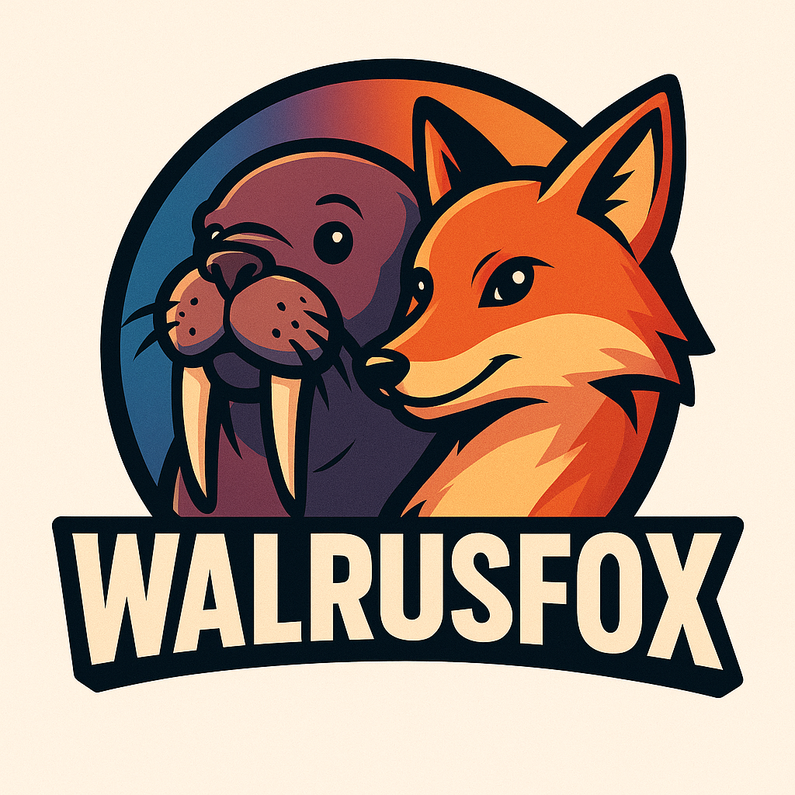

# WalrusFox Native Host (Rust)

This repository contains a Linux-only native messaging host for the Pywalfox Firefox add-on. It bridges Firefox with your current Pywal color scheme
and exposes control commands (update colors, switch theme mode, etc.). It communicates with the browser via the Native Messaging API and with local
helper processes via a Unix domain socket.

Original project: https://github.com/Frewacom/pywalfox

- This is a rust rewrite of the original Python version, just for fun (and because I dont like Python)
- Not all features are implemented yet (setting color and theme mode works).
- Only works on linux (tested with Firefox and Thunderbird on Ubuntu 24.04 lts)
- Use wallust https://codeberg.org/explosion-mental/wallust to create colorscheme files
- It needs the pywalfox Firefox extension to work https://addons.mozilla.org/en-US/firefox/addon/pywalfox/

## High-level overview

Components in this repo:

- Native messaging host (stdin/stdout) that talks to Firefox.
- Local Unix socket server to accept control commands.
- CLI utilities to install/uninstall the Firefox native host manifest and to send commands to the running server.

Data flow:

1. The server binds a Unix domain socket at `$XDG_RUNTIME_DIR/walrusfox/walrusfox.sock` (or `/tmp/walrusfox.sock` as a fallback) and relays any line
   received from one client to all other connected clients.
2. The extension client connects to that socket and listens for commands (update, dark, light, auto). When it receives one, it emits the appropriate
   native message back to Firefox via stdout.
3. The native host also listens for requests from the browser (e.g., `debug:version` and `action:colors`) and returns responses, including current
   colors.

Pywal/Wallust integration:

- Colors (and optional wallpaper) are read from `~/.cache/wal/walrusfox.json` by default, or from the path provided via `WALRUSFOX_COLORS`.

## Commands and usage

Build requirements: recent Rust toolchain (stable), cargo.

Build:

- cargo build --release

Run (common tasks):

- Start the socket server:
    - cargo run -- start
- Start the native host process that connects Firefox to the local socket (typically launched by Firefox via the manifest):
    - cargo run -- connect
- Install the Firefox native messaging manifest (user scope):
    - cargo run -- install
- Uninstall the manifest and helper files:
    - cargo run -- uninstall
- Trigger a refresh of colors (broadcast to connected clients; the extension client will forward to Firefox):
    - cargo run -- update
- Set theme mode to dark/light/auto:
    - cargo run -- dark
    - cargo run -- light
    - cargo run -- auto
- Connectivity and diagnostics:
    - cargo run -- health
    - cargo run -- diagnose
- Print the Firefox native messaging manifest JSON (no file changes):
    - cargo run -- print-manifest

Notes:

- In normal usage, Firefox launches the native host according to the manifest. You should keep the server running (e.g., via a systemd user service)
  so CLI commands can be delivered to the extension client.
- `install` creates the following in your home directory:
    - Native messaging manifest at `~/.mozilla/native-messaging-hosts/pywalfox.json` (host name kept for compatibility).
    - Small launcher script `~/.mozilla/native-messaging-hosts/walrusfox.sh` that runs `walrusfox connect`.
    - A systemd user unit at `~/.config/systemd/user/walrusfox.service` that runs the server; enable it with
      `systemctl --user enable --now walrusfox.service`.

## Native message schema (current)

Incoming requests from the browser (stdin) are JSON objects with an `action` string. Recognized actions:

- `debug:version` → returns the program version string.
- `action:colors` → returns the colors and optional wallpaper path.

Outgoing responses to the browser have the shape:

- `action`: one of `debug:version` | `action:colors` | `theme:mode` | `action:invalid`
- `success`: boolean
- `error`: optional string
- `data`: payload (varies by action)

Example successful colors response:
{
"action": "action:colors",
"success": true,
"error": null,
"data": {
"colors": ["#111111", "#222222", "..."],
"wallpaper": "/path/to/wallpaper.jpg"
}
}

Example theme mode response (when a CLI command is received via the socket):
{
"action": "action:theme:mode",
"success": true,
"error": null,
"data": "dark"
}

## Modules overview

- src/main.rs: Entry point; parses CLI with clap and dispatches to subcommands. Also initializes file-based tracing.
- src/bridge.rs: Connects native messaging to the Unix socket; handles browser requests and socket commands.
- src/client.rs: CLI client for sending single commands to the socket, plus health/diagnose helpers.
- src/server.rs: Unix domain socket server that broadcasts line-based commands to all connected clients except the sender.
- src/installer.rs: Install/uninstall the Firefox native messaging manifest and helper files (systemd unit, launcher script).
- src/config.rs: Constants and filesystem paths (host name, allowed extension ID, socket path, log path).
- src/protocol/events.rs: Action and command enums and parsing.
- src/protocol/native_messaging.rs: Helpers to encode/decode Native Messaging frames and build responses.
- src/utils/cli.rs: clap CLI definitions and available subcommands.
- src/utils/themes.rs: Reads `~/.cache/wal/walrusfox.json` (or `WALRUSFOX_COLORS`) to extract colors and wallpaper.

## Logging

- Controlled by `RUST_LOG` env (e.g., `RUST_LOG=info` or `RUST_LOG=walrusfox=debug`).
- Destination: if `WALRUSFOX_LOG` is set, logs go to that file; otherwise we try the XDG state directory (e.g.,
  `$XDG_STATE_HOME/de/linket/walrusfox/walrusfox.log`). If that’s unavailable, logs fall back to `/tmp/walrusfox.log`.

## Paths and configuration

- Socket path resolution precedence:
    1) `WALRUSFOX_SOCKET` (exact path)
    2) `$XDG_RUNTIME_DIR/walrusfox/walrusfox.sock` (dir created with 0700)
    3) `/tmp/walrusfox.sock` (fallback)
- Log file path resolution precedence:
    1) `WALRUSFOX_LOG`
    2) XDG state dir as above
    3) `/tmp/walrusfox.log` fallback

## Limitations

- Linux/Unix only (uses Unix domain sockets and Unix-specific paths).
- Only user-scope manifest install/uninstall is implemented (no system-wide option yet).
- No authentication/authorization on the socket; any local process can connect and send commands. Socket permissions are set to 0600; prefer
  `$XDG_RUNTIME_DIR` for best isolation.
- No Windows/macOS support.

## Development

- Format/lint: standard Rust tooling (rustfmt, clippy).
- Tests: a few unit tests included.

## License

See LICENSE in this repository.
